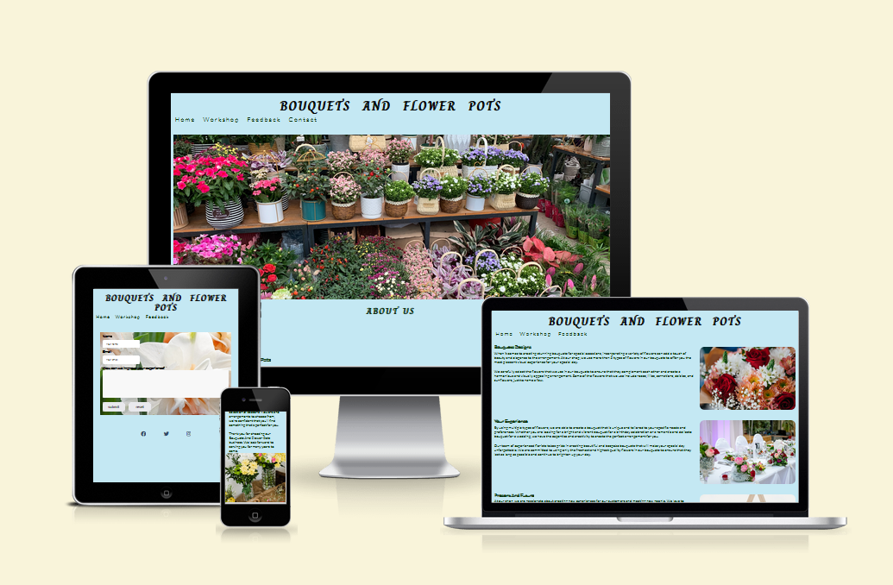
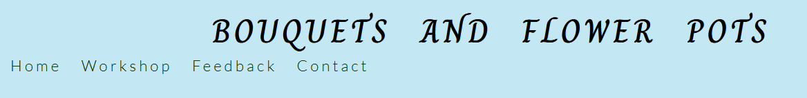
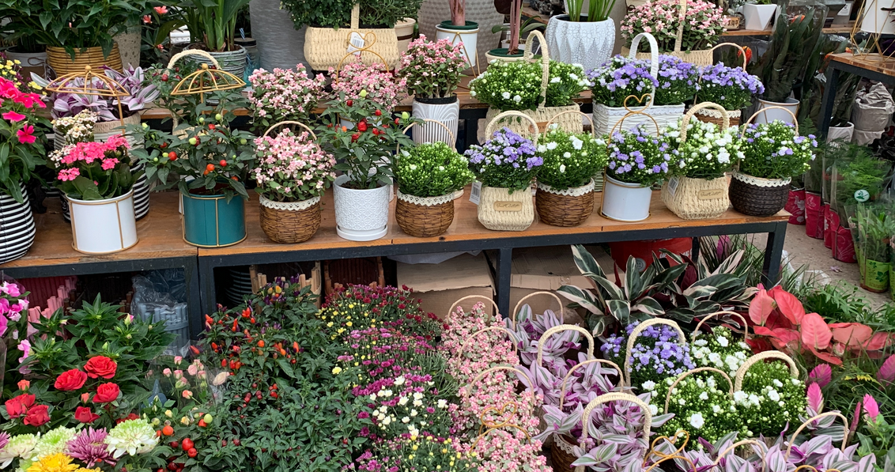
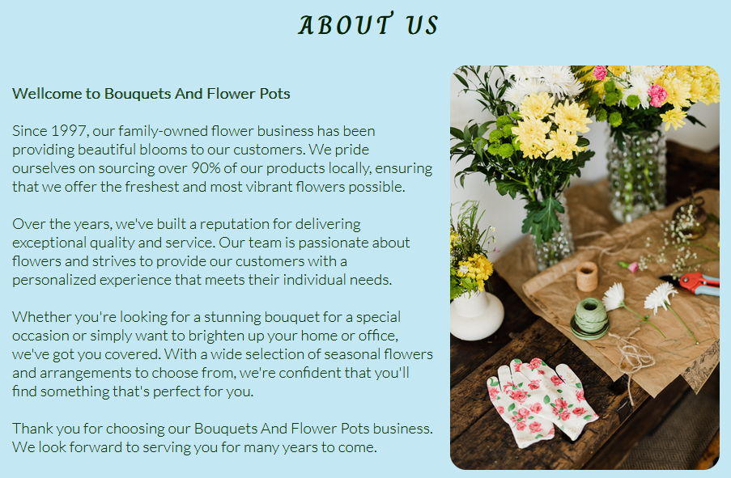
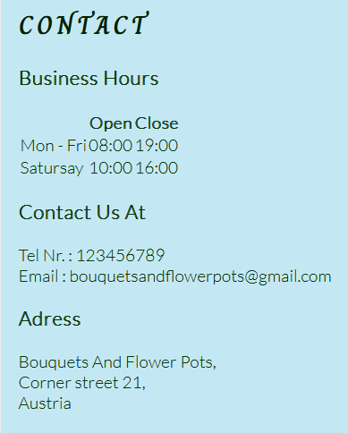
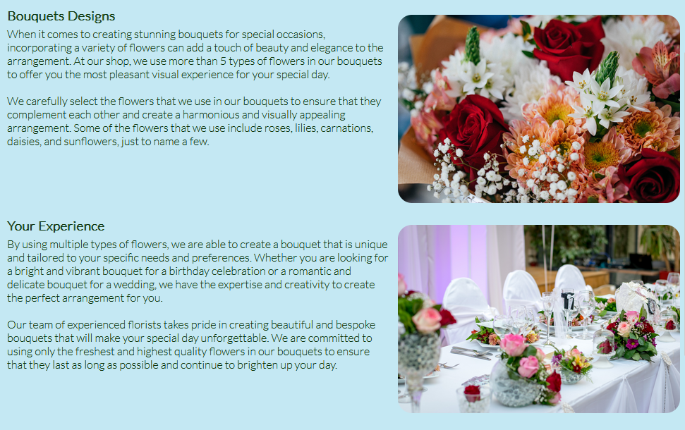
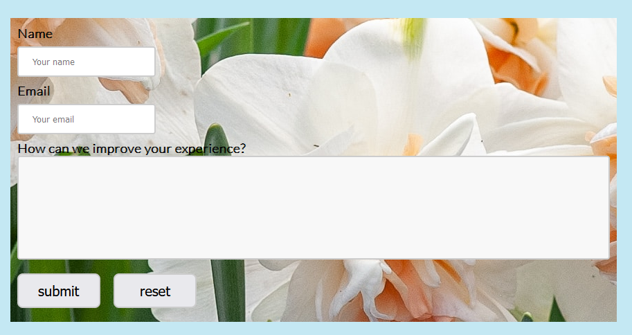

# Bouquets And Flower Pots

Bouquets and Flower Pots is a flower shop website that is dedicated to providing customers with beautiful and high-quality floral arrangements for all occasions. Our website caters to people of all ages and genders who want to make their loved one's day more beautiful, whether it be for a birthday, anniversary, wedding, or any other special event.

We offer a wide variety of flowers, ranging from classic roses to unique and exotic blooms, to suit the specific needs and preferences of our customers. Our skilled florists are passionate about their craft and use their expertise to create stunning arrangements that will leave a lasting impression.

We also have a selection of pre-designed bouquets and flower arrangements for customers who are in a rush or need some inspiration. Our pre-designed arrangements are perfect for last-minute gifts or for those who may be unsure of what flowers to choose.

In addition to our floral arrangements, we also have a variety of flower pots and vases available for purchase. These decorative vessels are the perfect complement to any floral arrangement and can be used to display flowers in any home or office space.

## Features 

The home page is designed to offer a quick introduction to our business and provide essential information about who we are. Additionally, we want to make it easy for people to get in touch with us by including our contact details.

The workshop section of our website is intended to provide you with more in-depth information about our work and experience. Here, you will find detailed descriptions of our services, along with examples of past projects we have worked on.

Our feedback page is designed to give people the opportunity to share your thoughts and experiences with our shop. We welcome both positive and negative feedback and strive to use it to improve our services and better meet your needs.

### Existing Features

- __Navigation Bar__

  - The navigation bar is a key feature of our website, designed to provide you with quick and easy access to all three pages of our site - the home page, workshop page, and feedback page.
  - This section will allow the user to easily navigate from page to page across all devices without having to revert back to the previous page via the ‘back’ button. 

- __The landing page image__

  - This image provides an excellent visual representation of the front of our shop. It offers a clear view of our storefront.
  - By showcasing our storefront in this way, we hope to communicate our professionalism, attention to detail, and commitment to providing the highest quality service. 

- __About Us Section__

  - The "About Us" section of our website is intended to provide you with a brief but informative overview of our business. Here, you will find information about our company's history, values, and future.

  - By sharing this information with reader, we hope to build trust and establish a strong connection between our business and our clients.

- __Business Hour And Contact Information__

  - This section of the website is designed to provide you with essential information about the business and how to get in touch with.
  - Here, you will find the working hours, location, and contact information, including the phone number and email address. 

- __The Footer__ 

  - The footer section includes links to the relevant social media sites for Bouquets And Flower Pots. The links will open to a new tab to allow easy navigation for the user. 
  - The footer is valuable to the user as it encourages them to keep connected via social media.
  - The footer idea was taken from Love Running project.

- __The Workshop Page__

  - This section of our website is intended to give you a more detailed understanding of our flower business.
  - Whether the user is interested in wedding flowers, corporate event design, or simply want to browse our portfolio, workshop section offers a comprehensive look at the services it offer and the work we do. 

- __The Feedback Page__

  - This page will allow the user to get signed up to Love Running to start their running journey with the community. The user will be able specify if they would like to take part in road, trail or both types of running. The user will be asked to submit their full name and email address. 

|

### Features Left to Implement

- Another feature that I'm looking to implement in the future is a gallery page for my shop, giving people the chance to view our work without on the website without accesing the social media.

- Making the contact button work on all our pages, as I could not implement that as it requires some Java knowledge

## Testing 

- I  tested if this website works on different browsers: Chrome, Firefox

- I confirmed that this project is responsive, looks good, and functions on all standard screen sizes using the devtools provided by Firefox and Chrome.

- I confirmed that the Header and navigation are readable and easy to understand.

- I confirmed that the form on the feedback page works and requires a valid email and made sure that submit and reset button works. 

### Validator Testing 

- HTML
  - No errors were returned when passing through the official 

- CSS
  - No errors were found when passing through the official 

### Unfixed Bugs

- No unfixed bugs

## Deployment

This section should describe the process you went through to deploy the project to a hosting platform (e.g. GitHub) 

- The site was deployed to GitHub pages. The steps to deploy are as follows: 
  - In the GitHub repository, navigate to the Settings tab 
  - From the source section drop-down menu, select the Master Branch
  - Once the master branch has been selected, the page will be automatically refreshed with a detailed ribbon display to indicate the successful deployment. 

The live link can be found here - https://code-institute-org.github.io/love-running-2.0/index.html 

## Credits 

In this section you need to reference where you got your content, media and extra help from. It is common practice to use code from other repositories and tutorials, however, it is important to be very specific about these sources to avoid plagiarism. 

You can break the credits section up into Content and Media, depending on what you have included in your project. 

### Content 

- The text for the Home page was taken from Wikipedia Article A
- Instructions on how to implement form validation on the Sign Up page was taken from [Specific YouTube Tutorial](https://www.youtube.com/)
- The icons in the footer were taken from [Font Awesome](https://fontawesome.com/)

### Media

- The photos used on the home and sign up page are from This Open Source site
- The images used for the gallery page were taken from this other open source site

Congratulations on completing your Readme, you have made another big stride in the direction of being a developer! 

## Other General Project Advice

Below you will find a couple of extra tips that may be helpful when completing your project. Remember that each of these projects will become part of your final portfolio so it’s important to allow enough time to showcase your best work! 

- One of the most basic elements of keeping a healthy commit history is with the commit message. When getting started with your project, read through [this article](https://chris.beams.io/posts/git-commit/) by Chris Beams on How to Write  a Git Commit Message 
  - Make sure to keep the messages in the imperative mood 

- When naming the files in your project directory, make sure to consider meaningful naming of files, point to specific names and sections of content.
  - For example, instead of naming an image used ‘image1.png’ consider naming it ‘landing_page_img.png’. This will ensure that there are clear file paths kept. 

- Do some extra research on good and bad coding practices, there are a handful of useful articles to read, consider reviewing the following list when getting started:
  - [Writing Your Best Code](https://learn.shayhowe.com/html-css/writing-your-best-code/)
  - [HTML & CSS Coding Best Practices](https://medium.com/@inceptiondj.info/html-css-coding-best-practice-fadb9870a00f)
  - [Google HTML/CSS Style Guide](https://google.github.io/styleguide/htmlcssguide.html#General)

Getting started with your Portfolio Projects can be daunting, planning your project can make it a lot easier to tackle, take small steps to reach the final outcome and enjoy the process! 

[def]: assets/image-for-readme/am%20i%20responsive.png